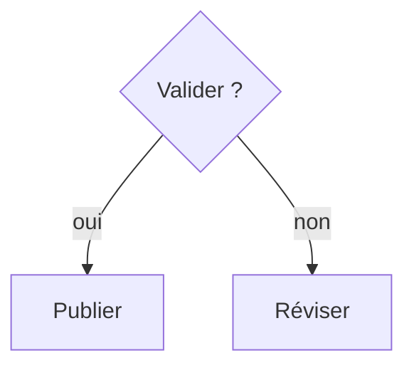

# Choisir le format de présentation

Ce guide choisit le format de la **sortie condensée**. Il ne modifie pas les protections de contenu : code, tableaux de référence et frontmatter restent préservés.

## Cadre de décision

| Information à présenter | Format à choisir | Limite utile |
|---|---|---|
| Contexte, justification, exception, décision, nuance ou causalité | Court paragraphe | Une idée principale par paragraphe |
| Éléments homogènes sans ordre | Liste à puces | Items parallèles et concis |
| Procédure, priorité ou séquence significative | Liste numérotée | Une action ou étape par item |
| Paires simples terme-définition | Liste de définitions si la cible les rend nativement ; sinon texte portable | Terme court, définition directe |
| Comparaison ou matrice avec 3 attributs liés ou plus par entité | Tableau simple | En-têtes explicites, cellules concises |
| Topologie : embranchement, interaction, dépendance/hiérarchie ou états | Mermaid, sous conditions | Le graphe porte l'information relationnelle |

N’utilise pas un tableau pour la mise en page, des blocs de code ou une procédure. N’utilise pas Mermaid pour une procédure linéaire, une liste simple, une comparaison simple, de la décoration ou un graphe exigeant une longue légende.

### Liste de définitions

Utilise cette syntaxe seulement si la cible la rend nativement :

```markdown
Terme
: Définition brève.
```

Si le rendu est inconnu ou non pris en charge, utilise le repli portable : `**Terme** : définition brève.`

## Checklist de choix

1. Le format le plus simple suffit-il ? Utilise un court paragraphe pour expliquer contexte, décision ou nuance.
2. Les éléments sont-ils homogènes et sans ordre ? Utilise des puces.
3. L’ordre, la priorité ou la succession change-t-il le sens ? Utilise une liste numérotée.
4. S’agit-il de paires simples terme-définition ? Utilise une liste de définitions seulement si la cible la rend ; sinon `**Terme** : définition`.
5. Compare-t-on chaque entité sur au moins trois attributs liés ? Utilise un tableau simple avec en-têtes explicites.
6. Les relations elles-mêmes sont-elles l’information — embranchement, interaction, dépendance, hiérarchie ou états ? Évalue Mermaid.
7. Le format reste-t-il accessible ? Préfère l’équivalent textuel si la lisibilité ou le rendu n’est pas assuré.

## Mermaid : conditions et accessibilité

Utilise Mermaid seulement si la plateforme cible le rend nativement. Si la cible est inconnue, demande où le contenu sera lu avant de générer Mermaid. Si le rendu n’est pas disponible, fournis le format textuel équivalent.

Pour tout diagramme Mermaid non décoratif :

- ajoute `accTitle` et `accDescr` ;
- ajoute, quand nécessaire, un équivalent textuel adjacent qui conserve toutes les relations indispensables ;
- n’encode pas de sens uniquement par la couleur ;
- évite les croisements d’arêtes excessifs et toute information essentielle visible seulement dans le diagramme.

Exemple minimal :


